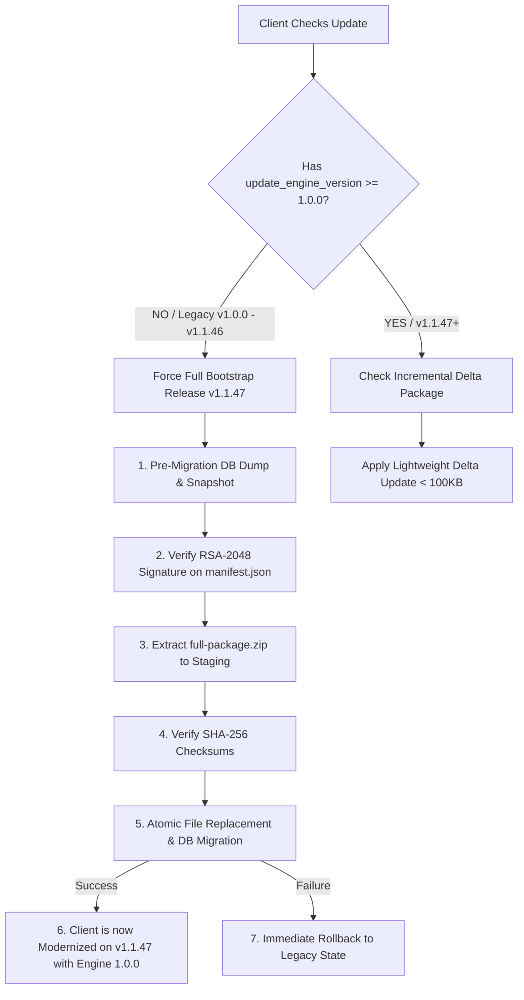

# POS Update Infrastructure: Bootstrap Migration Guide

## 1. Purpose of the Bootstrap Release (v1.1.47)

Prior to version `1.1.47`, existing client installations operated on a legacy architecture that lacked:
- Delta Update staging and atomic replacement engines.
- RSA-2048 cryptographic signature verification.
- Pre-update atomic file snapshots and database backup dumps.
- Automatic migration rollback and startup interrupted state recovery.

The **Bootstrap Release (v1.1.47-bootstrap)** serves as the migration bridge. It packages the full, modern codebase and installs `update_engine_version: "1.0.0"`. Once applied, client installations join the GitHub Releases delta update ecosystem.

---

## 2. Architecture & Migration Flow



---

## 3. How Existing Customers Migrate

Existing legacy clients (running `v1.0.0` through `v1.1.46`):
1. The legacy update checker connects to GitHub Releases or the update API.
2. The server detects that the client has no `update_engine_version` record in `version.json`.
3. The client receives `release/1.1.47-bootstrap/full-package.zip` (with `type: "full"` and `migration_release: true`).
4. The client replaces the full application files, writes `version.json` with `update_engine_version: "1.0.0"`, and runs database migrations `045`, `046`, and `047` (creating update history and permissions).
5. Next time the client checks for updates, it is recognized as a modern client capable of incremental delta updates.

---

## 4. How Future Releases Work (v1.1.48+)

Once upgraded to `v1.1.47`:
- Releases are published as small, incremental **Delta Packages** generated via:
  ```powershell
  powershell -ExecutionPolicy Bypass -File scripts/generate-delta-package.ps1 -ToVersion 1.1.48 -FromVersion 1.1.47
  ```
- Clients only download changed files (e.g. 1–5 files, ~50 KB total) packaged in `delta-1.1.47-to-1.1.48.zip`.
- Administrators can monitor and manage updates from **Settings > System and Maintenance > Admin Update Center**.

---

## 5. Emergency Rollback Procedure

If a bootstrap or delta update encounters an issue:

### Automatic Rollback
If a database migration fails or file replacement is interrupted:
- `DeltaUpdateService` automatically intercepts the failure.
- Files are restored from `storage/update-backups/patch_{old}_to_{new}_{timestamp}/files/`.
- Transaction state is recorded as `rolled_back`.

### Manual 1-Click Rollback via Admin Update Center
1. Open POS Dashboard &rarr; **Settings** &rarr; **System and Maintenance**.
2. Click **"نقاط الاسترجاع" (Rollback Snapshots)**.
3. Select the desired pre-update snapshot.
4. Click **"استرجاع هذه النسخة (Rollback)"** and confirm.
5. The system restores all files and prompts a page reload within 1.2 seconds.

### CLI Emergency Rollback
If the frontend is inaccessible:
```bash
C:\xampp\php\php.exe -r "require 'backend/vendor/autoload.php'; \$d = new App\Services\DeltaUpdateService(); \$d->rollbackFiles('backend/storage/update-backups/{snapshot_dir_name}');"
```
