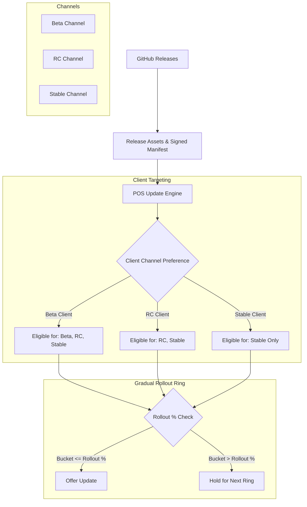

# POS Release Channels & Gradual Rollout Guide

## 1. Overview & Architecture

Phase 10 adds **Release Channels** and **Deterministic Gradual Rollout** to the POS Update Infrastructure. It allows staged distribution, early validation of beta and release candidate builds on testing terminals, and controlled risk mitigation through percentage-based rollout rings.



---

## 2. Release Channels Hierarchy

| Channel | Intended Audience | Eligible Releases |
| :--- | :--- | :--- |
| **`stable`** | All standard store POS terminals in production | Stable releases only |
| **`rc`** | Pilot store terminals / QA devices | Release Candidates (`rc`) & `stable` releases |
| **`beta`** | Internal testing terminals / Staging environments | `beta`, `rc`, & `stable` releases |

### Client Configuration
Stored in `version.json` or configured via the environment variable `APP_UPDATE_CHANNEL`:
```json
{
  "version": "1.1.49",
  "application_version": "1.1.49",
  "update_engine_version": "1.0.0",
  "update_channel": "stable"
}
```

---

## 3. Manifest Channel & Rollout Specification

Release manifests generated during CI/CD include the channel and gradual rollout target percentage:

```json
{
  "manifest_version": "1.0",
  "version": "1.1.50",
  "channel": "beta",
  "rollout_percentage": 25,
  "type": "delta",
  "minimum_version": "1.1.49",
  "update_engine_version": "1.0.0",
  "requires_npm_install": false,
  "changelog": [
    "Experimental POS performance enhancements",
    "Enhanced error tracking"
  ],
  "files": [
    {
      "path": "backend/Helpers/Logger.php",
      "action": "replace",
      "sha256": "4b68e99...bf8",
      "size": 7183
    }
  ]
}
```

---

## 4. Deterministic Gradual Rollout Algorithm

To prevent flapping or random update availability, client eligibility is deterministically calculated using a persistent terminal `device_id` and the release `target_version`:

$$\text{Seed} = \text{hash}(\text{"sha256"}, \text{"pos:rollout:"} + \text{deviceId} + \text{":"} + \text{targetVersion})$$
$$\text{Bucket} = (\text{hexdec}(\text{substr}(\text{Seed}, 0, 8)) \pmod{100}) + 1$$

$$\text{Eligible} \iff \text{Bucket} \le \text{RolloutPercentage}$$

### Properties:
1. **100% Deterministic**: Multiple checks by the same terminal on the same release always yield the exact same decision.
2. **Evenly Distributed**: SHA-256 uniform distribution ensures true proportional rollout across terminals (e.g. 25% rollout reaches $\approx 25\%$ of devices).
3. **Privacy Safe**: Device ID is a pseudorandom UUID v4 stored in `backend/storage/.device_id` without exposing hardware MAC addresses or serial numbers.
4. **Ring Escalation**: If a release is bumped from 25% to 50%, all devices in the first 25% remain eligible, and new devices are smoothly added.

---

## 5. Admin Update Center Operations

Authorized store administrators can view and switch release channels from **Settings &rarr; System & Updates**:

1. **Channel Dropdown**: Switch between `Stable (مستقر)`, `Beta (تجريبي)`, and `RC (مرشح للإطلاق)`.
2. **Access Control**: Protected by the RBAC permission `updates.manage_channel`.
3. **Rollout Status Indicator**: Clearly shows when a release is currently in a gradual rollout ring.

---

## 6. Verification Test Suite

Run the automated test runner to verify all 5 release channel scenarios:
```bash
php scripts/test-release-channels.php
```

All 5 scenarios validate:
- **Scenario 1**: Stable client ignores beta release `v1.1.50-beta`.
- **Scenario 2**: Beta client accepts beta release `v1.1.50-beta`.
- **Scenario 3**: 25% gradual rollout across 100 simulated devices yields uniform distribution.
- **Scenario 4**: Same device checked 20 times produces 100% identical decision.
- **Scenario 5**: Atomic rollback restores files and channel configuration properly.
