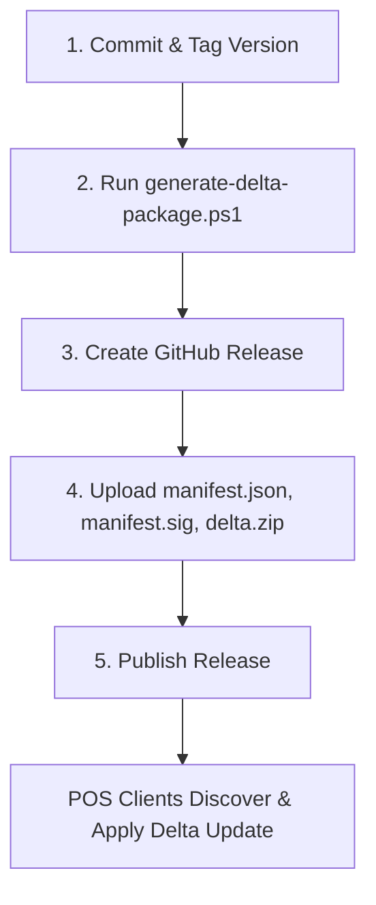

# Release Management Workflow & Developer Guide

## 1. Overview
The POS update distribution platform utilizes **GitHub Releases** as a zero-cost, highly scalable, and secure content delivery network. Updates are cryptographically signed with developer RSA-2048 keys to ensure integrity and authenticity.

---

## 2. Release Assets Overview

Every new release published on GitHub Releases must include the following assets:

| Asset Name | Purpose | Description |
|---|---|---|
| `manifest.json` | Update Manifest | JSON payload specifying target version, minimum required version, changed files list with SHA-256 hashes, and actions (`replace`, `add`, `delete`). |
| `manifest.sig` | RSA-SHA256 Digital Signature | Cryptographic signature of `manifest.json` generated using developer private key. |
| `delta-{from}-to-{to}.zip` | Delta Update Archive | Compressed archive containing only the modified files maintaining exact repository directory structure. |
| `POS-Setup-{version}.exe` | Full Installer *(Optional)* | Full standalone installer for fresh installations or full recovery. |

---

## 3. Step-by-Step Release Workflow



### Step 1: Create and Push Git Tag
Tag the commit intended for production release:
```bash
git checkout main
git pull origin main
git tag -a v1.1.48 -m "Release v1.1.48: Fixed product sync and logger"
git push origin v1.1.48
```

---

### Step 2: Generate Signed Delta Package
Execute the PowerShell release generator script from the project root:
```powershell
.\scripts\generate-delta-package.ps1 `
  -ToVersion 1.1.48 `
  -FromVersion 1.1.47 `
  -PrivateKeyPath "release/private_key.pem"
```

#### What the script does automatically:
1. Compares Git diff between `-FromVersion` and `-ToVersion`.
2. Identifies modified and newly added files (excluding ignored `.env`, `storage/`, `vendor/`, `node_modules/`).
3. Computes SHA-256 cryptographic hashes for every file.
4. Generates standard `manifest.json`.
5. Cryptographically signs `manifest.json` using RSA-2048 private key &rarr; outputs `manifest.sig`.
6. Packages changed files into `delta-1.1.47-to-1.1.48.zip` and `delta.zip`.
7. Prepares the release folder in `release/1.1.48/`.

---

### Step 3: Create GitHub Release
1. Open GitHub repository &rarr; **Releases** &rarr; **Draft a new release**.
2. Select tag: `v1.1.48`.
3. Release Title: `v1.1.48 - Release Notes`.
4. Enter changelog bullet points in release description.

---

### Step 4: Upload Release Assets
Upload the generated files located in `release/1.1.48/`:
- `release/1.1.48/manifest.json`
- `release/1.1.48/manifest.sig`
- `release/1.1.48/delta-1.1.47-to-1.1.48.zip`

---

### Step 5: Publish Release
Click **Publish Release**.
- POS clients checking for updates will automatically detect `v1.1.48`.
- Clients download `manifest.json` and `manifest.sig`, verify the RSA digital signature using the embedded public key, download the small delta package (e.g. ~40 KB instead of full 100 MB), take a pre-update snapshot, atomically replace files, and run database migrations.

---

## 4. Key Management & Security Best Practices

1. **Private Key (`release/private_key.pem`)**:
   - MUST be kept secure by the developer/CI environment.
   - NEVER commit `private_key.pem` into public version control.

2. **Public Key (`backend/certs/update_public_key.pem`)**:
   - Embedded in the POS application distribution.
   - Used by `ManifestSignatureService` to verify all updates.

3. **Key Rotation**:
   - If rotating keys, deploy a transitional release updating `update_public_key.pem` before switching the signing key.
