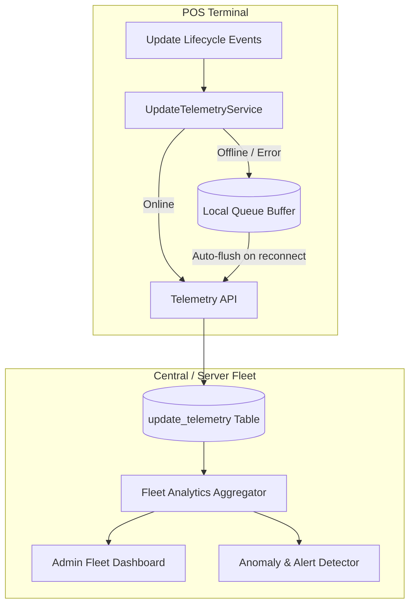

# POS Update Telemetry & Fleet Management Guide

## 1. Overview & Architecture

Phase 11 introduces **Update Telemetry and Fleet Management** into the POS update ecosystem. It allows operations and release engineers to observe terminal distribution, rollout adoption, update health, and anomaly detection across all POS devices in real-time.



---

## 2. Strict Privacy & Security Model

The telemetry subsystem is purposefully engineered to guarantee complete privacy.

### What is Collected:
- **`device_id`**: Anonymous, pseudorandom UUID v4 persisted in `backend/storage/.device_id`.
- **`current_version`**: Active application semver string (e.g. `1.1.48`).
- **`target_version`**: Destination release semver string (e.g. `1.1.49`).
- **`channel`**: Client update channel (`stable`, `beta`, `rc`).
- **`event_type`**: Update lifecycle event name.
- **`success`**: Boolean status flag (`1` for success, `0` for failure).
- **`error_code`**: Standardized error identifier (e.g. `signature_verification_failed`).
- **`duration_ms`**: Duration of download or apply operation in milliseconds.
- **`created_at`**: Timestamp.

### What is NEVER Collected:
- ❌ **No Customer Data** (names, phones, emails, debts).
- ❌ **No Product or Inventory Data** (prices, quantities, barcodes).
- ❌ **No Financial or Sales Data** (invoices, profits, cash totals).
- ❌ **No User Account Credentials or Passwords**.
- ❌ **No Hardware Fingerprinting** (No MAC addresses, CPU serials, or motherboards).
- ❌ **No Raw Database Dumps or SQL Queries**.

---

## 3. Telemetry Event Lifecycle

| Event Type | Trigger |
| :--- | :--- |
| **`update_check_started`** | Triggered when a terminal checks for updates. |
| **`update_available`** | Emitted when a compatible newer release is found. |
| **`update_download_started`** | Emitted when the download of a delta or full package starts. |
| **`update_download_completed`**| Emitted when package download and SHA256 validation succeed. |
| **`update_applied`** | Emitted upon successful atomic file replacement and database migration. |
| **`update_failed`** | Emitted when an error occurs during verification, replacement, or migration. |
| **`rollback_completed`** | Emitted when the terminal successfully rolls back to an earlier snapshot. |

---

## 4. Offline Resilience & Non-Blocking Design

1. **Zero POS Blocking**: Telemetry logging runs asynchronously and safely in try-catch blocks. Network or database failures will never disrupt checkout, receipt printing, or sales.
2. **Local Queue Buffer**: If the backend database or network is unreachable, events are automatically queued in `backend/storage/telemetry_queue.json` (capped at 500 records).
3. **Automatic Flush**: Whenever the terminal checks for updates or syncs, buffered events are automatically flushed in batch.
4. **Kill Switch**: Setting `ENABLE_UPDATE_TELEMETRY=false` in `.env` disables all telemetry recording while leaving updates 100% operational.

---

## 5. Fleet Dashboard & Anomaly Alerts

Store administrators with the `updates.telemetry.view` permission can access the **Fleet Dashboard** via **Settings &rarr; أسطول التحديثات (Fleet)**:

- **Total Active Devices**: Unique terminals active over the past 30 days.
- **Version Distribution**: Real-time breakdown of versions across terminals.
- **Update Channels**: Distribution of terminals across `stable`, `beta`, and `rc`.
- **Health KPIs**: Global success vs failure rates.

### Automatic Alert Detection:
- 🔴 **High Failure Rate Alert**: Triggered if update failure rate exceeds **10%** across the fleet.
- 🟡 **Recent Rollbacks Alert**: Triggered if any terminal experiences a rollback in the last 30 days.
- 🔵 **Outdated Terminals Alert**: Triggered if terminals remain on versions older than v1.1.48.

---

## 6. Retention Policy & Data Pruning

Telemetry logs can be pruned to prevent unlimited database growth:
- **Default Retention**: 90 days.
- **Admin Purge**: Authorized admins (`updates.telemetry.manage`) can trigger retention pruning via the dashboard or API endpoint:
  ```http
  POST /api/admin/fleet/purge
  Content-Type: application/json

  {
    "days": 90
  }
  ```

---

## 7. Verification & Automated Testing

Run the telemetry test suite:
```bash
php scripts/test-update-telemetry.php
```

All 7 core scenarios are validated:
1. Successful event ingestion
2. Failed event ingestion with error tracking
3. Rollback event recording
4. Strict payload validation & rejection of non-update events
5. Offline queue buffering and batch transmission
6. Fleet statistics & alert calculation
7. Data retention purge execution
