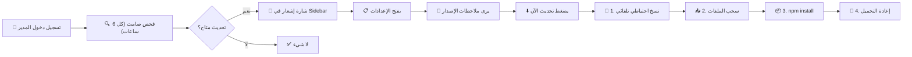

# 🚀 ترقية نظام التحديثات — المستوى الاحترافي

## المشكلة مع النظام الحالي
النظام الحالي يعمل لكنه "غبي" — يفحص فقط رقم الإصدار ويسحب الملفات. لا يوجد:
- ❌ نسخ احتياطي تلقائي قبل التحديث
- ❌ إشعار مرئي يخبر المدير بوجود تحديث دون أن يذهب للإعدادات
- ❌ تشغيل `npm install` عند وجود اعتماديات جديدة
- ❌ رقم الإصدار الحالي ظاهر في الواجهة
- ❌ فحص تلقائي في الخلفية
- ❌ ملاحظات إصدار مهيكلة (بدلاً من commit messages الخام)

---

## التحسينات المقترحة

### 1. تطوير `version.json` ليحمل ملاحظات الإصدار

#### [MODIFY] [version.json](file:///c:/xampp/htdocs/pos/version.json)
```json
{
  "version": "1.0.0",
  "released_at": "2026-04-13",
  "changelog": [
    "🎉 إطلاق نظام التحديثات التلقائية",
    "📄 إضافة ترقيم الصفحات للمنتجات والمبيعات والمشتريات",
    "🔒 تحسينات أمنية شاملة"
  ],
  "requires_npm_install": false
}
```
هذا يعني أنك كمطوّر، عند إصدار كل نسخة تكتب الملاحظات بلغة عربية مقروءة بدلاً من أن يرى المستخدم commit messages تقنية.

---

### 2. نسخ احتياطي تلقائي + npm install + تقدم مرحلي

#### [MODIFY] [UpdateController.php](file:///c:/xampp/htdocs/pos/backend/controllers/UpdateController.php)

**التحسينات:**
- **`check()`**: يجلب أيضاً `changelog` و `requires_npm_install` من version.json البعيد.
- **`apply()`**: يُنفّذ 4 خطوات مرئية:

| الخطوة | الوصف |
|--------|-------|
| 1️⃣ | نسخ احتياطي لقاعدة البيانات تلقائياً (مثل زر التحميل في الإعدادات) |
| 2️⃣ | `git fetch origin main` + `git reset --hard origin/main` |
| 3️⃣ | `npm install` فقط إذا كان `requires_npm_install: true` في version.json الجديد |
| 4️⃣ | إرجاع النتيجة مع رقم الإصدار الجديد |

- **`rollback()`** (جديد): إذا فشل التحديث → يستعيد النسخة الاحتياطية من قاعدة البيانات.

---

### 3. شارة إشعار في الشريط الجانبي 🔴

#### [MODIFY] [Sidebar.jsx](file:///c:/xampp/htdocs/pos/frontend/src/components/layout/Sidebar.jsx)

- عرض **نقطة حمراء صغيرة** بجانب أيقونة "الإعدادات" في الشريط الجانبي عند وجود تحديث.
- عرض **رقم الإصدار الحالي** أسفل الشريط الجانبي (مثلاً: `v1.0.0`).

---

### 4. فحص تلقائي صامت في الخلفية

#### [NEW] [updateStore.js](file:///c:/xampp/htdocs/pos/frontend/src/store/updateStore.js)

متجر Zustand جديد يقوم بـ:
- فحص التحديثات **تلقائياً عند تسجيل دخول المدير** (مرة كل 6 ساعات — مخزن في localStorage).
- تخزين حالة `hasUpdate` و `latestVersion` ليراها الشريط الجانبي والإعدادات.

---

### 5. واجهة الإعدادات المحسّنة

#### [MODIFY] [Settings.jsx](file:///c:/xampp/htdocs/pos/frontend/src/pages/Settings.jsx)

**التحسينات:**
- عرض **ملاحظات الإصدار** المهيكلة (من `changelog` في version.json) بدلاً من commit messages.
- **شريط تقدم مرحلي** أثناء التحديث (4 خطوات: نسخ احتياطي ← سحب الملفات ← تثبيت الاعتماديات ← إعادة التحميل).
- عرض **الإصدار الحالي** بشكل دائم في أعلى القسم.

---

## الملخص البصري



---

## مراجعة مطلوبة

> [!NOTE]
> هذه الترقية لا تتطلب أي إعداد إضافي من المستخدم — كل شيء تلقائي. الفرق الوحيد هو أنك كمطوّر ستحتاج عند كل إصدار لتعديل `version.json` وإضافة ملاحظات الإصدار بالعربية.

---

## خطة التحقق

### اختبار تلقائي
1. تسجيل دخول كمدير → التحقق من ظهور فحص صامت في الخلفية.
2. التحقق من ظهور شارة الإشعار إذا كان هناك تحديث.
3. تطبيق تحديث → التحقق من إنشاء نسخة احتياطية قبل التحديث.

### اختبار يدوي
1. تغيير `version.json` المحلي إلى `0.9.0` → التحقق من ظهور الشارة.
2. الدخول للإعدادات → التحقق من ظهور ملاحظات الإصدار.
3. تطبيق التحديث → التحقق من عمل شريط التقدم المرحلي.
